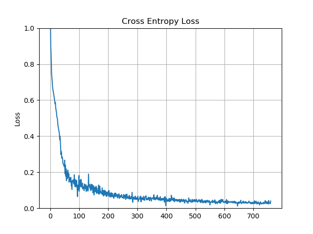
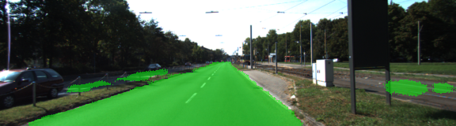
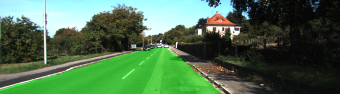
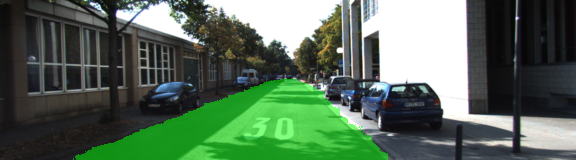
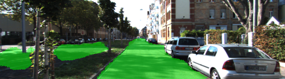

# Semantic Segmentation

This project is a part of Udacity's *Self-Driving Car Nanodegree* program. The
goal of the project is to implement and train a fully convolutional neural network 
that would identify a drivable road area from a car's frontal camera images. 

## Network architecture

The approach implemented in the project is described in the article 
[Fully Convolutional Networks for Semantic Segmentation](https://people.eecs.berkeley.edu/~jonlong/long_shelhamer_fcn.pdf).
The pre-trained VGG-16 is converted to a fully convolutional network by replacing 
the fully connected layers with 1x1 convolutions. The architecture is further customized 
by adding transposed convolutional layers that up-sample the results to the original image 
dimensions, effectively classifying each pixel from the source image. 

Skip connections are added to improve performance. Such connections take the intermediate 
results from deeper VGG layers (in this case, convolutional layers 3 and 4), and add them 
element-wise to the respective intermediate up-sampled results. Skip connections have been 
shown to improve the segmentation detail. To prevent overfitting, L2 regularization was used 
for 1x1 convolutional layers and up-sampling layers. 

## Training process

After a few experiments, I've come up with the following set of hyperparameters 
that provide good results on the test dataset: 

|                |                     | 
|:-------------- | -------------------:|
| Batch size     | 16                  |
| Epochs         | 40                  |
| Dropout rate   | 0.5                 |
| L2 reg         | 1e-4                |
| Learning rate  | 0.0001              |

## Results

Some of the results from the test dataset are shown below: 

As an optional challenge, I applied the trained network to a video from one of the 
previuos projects. The results make sense on average, but show that the performance 
of the segmentation should be improved (see Further Improvements for suggestions).

## Future improvements

* Use source image augmentation for more robust results;
* Use bigger training dataset (e.g. CityScapes);
* Use train/validation split and IOU metric to fine-tune hyperparameters. 

